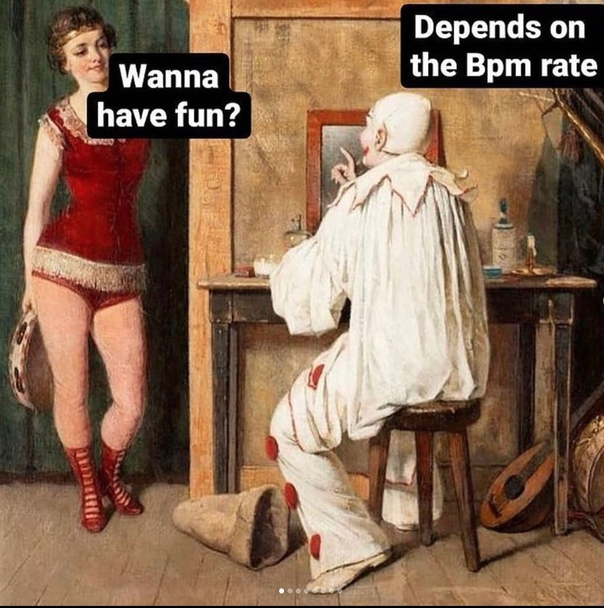

<!DOCTYPE html>

<!DOCTYPE html>
<head>
    <meta charset="utf-8">
    <link rel="stylesheet" href="styles.css">
    <title>Understanding DJ memes</title>
</head>

<body>
    

        <pre><a href="Page 3 (DJ memes)" target="_blank">Page 1</a>         <a href="Page2.html" target="_blank">page 2</a>         <a href="Page3.html" target="_blank">page 3</a>          <a href="page4" target="_blank">page 4</a>          <a href="page5" target="_blank">page 5</a>            <a href="page6" target="_blank">page 6</a></pre>
    

    <h1>What classifies as a DJ meme</h1>
    

    
 
        DJ memes vary in many different ways and have many subsections. The most pominenet them in DJ memes is any meme about DJing and DJ equipment (obviously). Other subsections of DJ memes may include raves, music , festivals and clubbing.

</body>
<main>
    <article>
      <header>
        <h2>DJ Memes: The Ultimate Source of Laughter for Music Lovers</h2>
        
Published on <time datetime="2023-05-26">May 26, 2023</time>

      </header>

      <section>
        <h3>Introduction</h3>
        
Welcome to my blog post dedicated to DJ memes! If you're a music enthusiast with a sense of humor, you're in the right place. In this article, we'll explore some hilarious DJ memes that will surely make you chuckle. Let's dive in!

      </section>

      <section>
        <h3>The Top DJ Memes</h3>
        <figure>
          
          <figcaption>Image source: meme-generator.com</figcaption>
        </figure>
        
Here's one of my favorite DJ memes. It perfectly captures the struggle of beatmatching when the tracks just don't seem to match up. We've all been there!

        <figure>
          
          <figcaption>Image source: memedj.com</figcaption>
        </figure>
        
This meme showcases the classic DJ reaction when someone requests a song that's completely off-genre. It's priceless!

      </section>

      <section>
        <h3>Conclusion</h3>
        
DJ memes bring joy and laughter to music lovers around the world. They provide a lighthearted glimpse into the world of DJs and their experiences. I hope you enjoyed these memes and had a good laugh. Stay tuned for more entertaining content on my blog!

      </section>
    </article>
  </main>

  <footer>
    
&copy; 2023 My DJ Memes Blog. All rights reserved.

  </footer>
</html>
